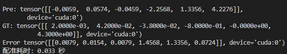
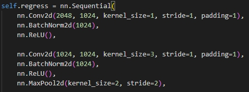
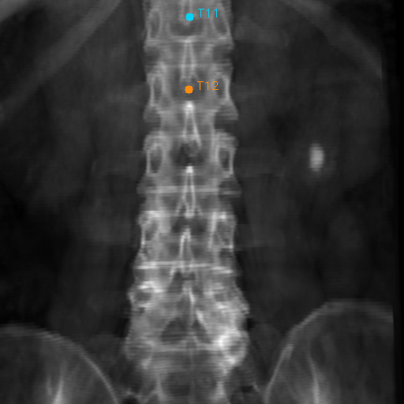

<!-- _class: cover_b fixedtitleA
<!-- _header: "" --> 
<!-- _footer: "" --> 
<!-- _paginate: "" --> 
<!-- _header:  -->

# 上海极睿医疗科技有限公司

###### 极睿影像算法--周会

徐少康
影像算法工程师
时间：2024 年   周五
<shaokang.xu@maestrosurgical.com>

##

<!-- _class: cols2_ol_ci fglass toc_a  -->
<!-- _footer: "" -->
<!-- _header: "Maestro" -->
<!-- _paginate: "" -->

- [Week 16：4月15日-4月19日（C++完善）](#week-164月15日-4月19日)
- [Week 17：4月22日-4月26日（后处理、参数）](#week-174月22日-4月26日)
- [Week 18-19：4月29日-5月10日（Spacing、参数）](#week-18-194月29日-5月10日)
- [Week 20：5月13日-5月17日（转换,合成数据）](#week-205月13日-5月17日)
- [Week 21：5月20日-5月24日（弹性代码 搭建）](#week-215月20日-5月24日)
- [Week 22：5月27日-5月31日（代码复现，3Dreg）](#week-225月27日-5月31日)
- [Week 23：6月3日-6月7日（X2CT，3Dreg）](#week-236月3日-6月7日)
- [Week 24：6月11日-6月14日（论文，数据集）](#week-246月11日-6月14日)
- [Week 25：6月17日-6月21日（模型，扩散）](#week-256月17日-6月21日)
- [Week 26：6月24日-6月28日（NipNet ）](#week-266月24日-6月28日)
- [Week 27：7月1日-7月5日（专利 ）](#week-277月1日-7月5日)
- [Week 28：7月8日-7月12日（模型 ）](#week-287月8日-7月12日)
- [Week 29：7月15日-7月19日（模型 ）](#week-297月15日-7月19日)
- [Week 30：7月22日-7月26日（模型 ）](#week-307月22日-7月26日)
- [Week 31：7月29日-8月02日（专利，模型 ）](#week-317月29日-8月02日)
- [Week 32：8月5日-8月9日（专利，模型 ）](#week-328月05日-8月09日)
- [Week 33：8月12日-8月16日（样本处理）](#week-338月12日-8月16日)
- [Week 34：8月19日-8月23日（检测定位-移植）](#week-348月19日-8月23日)
- [Week 35：8月26日-8月30日（胸腰椎数据整理）](#week-358月26日-8月30日)
- [Week 36：9月2日-9月6日](#week-369月2日-9月6日)

##

<!-- _class: cols2_ol_ci fglass toc_a  -->
<!-- _footer: "" -->
<!-- _header: "Maestro" -->
<!-- _paginate: "" -->
- [Week 37：9月9日-9月13日](#week-379月9日-9月14日)
- [Week 38：9月18日-9月20日](#week-389月18日-9月20日)


## Week 16：4月15日-4月19日

<!-- _class: trans -->
<!-- _footer: "" -->
<!-- _paginate: "" -->

## (一) C++：mask引导划分
<!-- _class: fixedtitleA  -->
<!-- _class: cols-2 -->

<div class=Ldiv>  

- 输入图像（共四张）

```markdown 
void SigleVertebraCtLocation()//单椎体图像定位
bool RoiDivide()//区域划分
```
</div>

<div class=img >

- 单椎体投影（共两张）
 

```
void InitSingleProDRR() //单椎体投影
```

</div>

## (二)C++：推理参数后处理
<!-- _class: fixedtitleA -->
<!-- _class: cols-2 -->

<div class=Ldiv>  

- 1、旋转点计算

</div>


<div class=Ldiv>  

(1)首先取投影平面中心点**center**；
(2)连接center与投影点**source**的两点向量；
(3)取离center的**1/10**处的点为旋转点；
```markdown 
void CalculateCenterPoint() //计算平面中心点
void CalculateRotPoint()  //计算所需旋转点
```
</div>

## Week 17：4月22日-4月26日

<!-- _class: trans -->
<!-- _footer: "" -->
<!-- _paginate: "" -->

## (一) 数据后处理
<!-- _class: fixedtitleA  -->
<!-- _class: cols-2 -->
<div class=Ldiv>  


</div>
<div class=rdiv>

1、输出参数处理
Model Output **---->** Final Output
```markdown
void ParamReprocess(float* OutParamAp, float* OutParamLat)
```

2、配准时间
```markdown
aiRegis.Execute(output_data, VerteNum)
```
平均时间小于0.5s
<rdiv>

## (二)、变换参数测试
<!-- _class: fixedtitleA  -->
<!-- _class: cols-2 -->
<div class=Ldiv>

- **测试**

变换参数1：[**0.1**, **0.05** ,**-0.06**, 5.1, 4.1, -2.1]
旋转点1：[ 10. 180. 151]

RT矩阵：
[[  **0.99695305**    **0.06464505**   **0.04365358** -13.09733043]
 [ **-0.05988907**   **0.9929145**   **-0.10263575**  21.47227898]
 [ **-0.04997917**   **0.09970865**  **0.99376067** -18.60562651]
 [  0.           0.           0.           1.        ]]

旋转点2：[100. 100. 100]
变换参数2：[**0.1**, **0.05** ,**-0.06**, -2.5, 4.5, -14.25]

- **结论：** 固定的RT变换中，旋转的三个参数R𝑥, R𝑦, R𝑧在数值上不因旋转点的变化而变化。

 </div>

 <div class=rdiv>

 
RP + T 
R(P-C1)+T+C = RP-**RC1+T+C1**
R(P-C2)+T+C = RP-**RC2+T+C2**
- 平移的部分参数数值受旋转点影响
 </div>

 ## (三)、New ideal
 <!-- _class: fixedtitleA  -->


 ## (四)、现阶段测试
 <!-- _class: fixedtitleA  -->





## Week 18-19：4月29日-5月10日

<!-- _class: trans -->
<!-- _footer: "" -->
<!-- _paginate: "" -->

## (一) Spacing 统一（缩减Shrink）
<!-- _class: fixedtitleA  -->
<!-- _class: cols-3 -->

 <div class=div>

- **Train Process**

- Spacing :0.2
- SIze :1024*1024
- **物理Size**：204.8*204.8
</div>


 <div class=div>

- **Test Process(X-ray)**
 
- Spacing :0.3
- Size :1000*1000
- **物理Size**：300*300
 </div>

 <div class=div>

- **Spacing Trans**

- 物理缩减：95.2
- Size缩减 ：95.2 / 0.3 = 317.3
- Size：683*683（1000-317）
- **物理Size**：204.8*204.8
- **局限性**：X-ray缩减以外的椎体无法配准。
</div>

## (二) Spacing 统一(扩充Expand)
<!-- _class: fixedtitleA  -->
<!-- _class: cols-3 -->

 <div class=div>

- **Train Process**

- Spacing :0.2
- SIze :1024*1024
- **物理Size**：204.8*204.8
</div>

 <div class=div>

- **Test Process(X-ray)**
 
- Spacing :0.15
- Size :1000*1000
- **物理Size**：150*150
 </div>

 <div class=div>

- **Spacing Trans**

- 物理扩充：54.8
- Size扩充 ：54.8 / 0.15 = 365.3
- Size :1365*1365(1000+365.3)
- **物理Size**：204.8*204.8
- **局限性**：扩充出来的区域可能会影响推理（用ROI区域框取可以解决）
</div>

 ## (三)输入图像调整 
<!-- _class: fixedtitleA  -->
<!-- _class: cols-2 -->
 <div class=div>

- **问题**：
1、Spacing统一（扩充）后出现多余空白区域
2、X-ray图像上相应机械仪器的遮挡影响
- **处理**
1、将X-ray图像ROI区域改为椎体框
2、直接用单椎体CT投影作为初始投影DRR图像(避免初始整体投影)


 </div>

 <div class=div>

   


 </div>

 ## (四) 
<!-- _class: fixedtitleA  -->

问题：Result（**6参数**or**RT矩阵**）


1、思考如何讲旋转点信息纳入网络中（**先验知识**）
2、如何讲**物理空间特征**转化为**图像空间特征**


 ## (五) 骨折配准初始方案（刚性 + 弹性）Coarse2Fine
<!-- _class: fixedtitleA  -->
 <div class=div>

- **刚性配准**
- 一、方法
    （1）、采用迭代的方式 (可以加入**ROI选择**/**质心对齐**)
    （2）、采用学习的方式（现有论文常用）
 </div>

 <div class=div>

- **弹性配准**
通过同样两个视图的2D图像与对应的X-ray图像通过网络获取3D变形场
 
 </div>


 ## (六) ROI选择/质心对齐
<!-- _class: fixedtitleA  -->
<!-- _class: cols-2 -->

 <div class=div>

- **质心对齐**
- 使用场景：在术前与术中量数据差异性过大
 

</div>


 <div class=div>

- **ROI选择**
- 使用场景：骨头存在部分区域无形变
 
- 选择无变形的区域作为迭代配准的ROI
</div>

## Week 20：5月13日-5月17日

<!-- _class: trans -->
<!-- _footer: "" -->
<!-- _paginate: "" -->


 ## (一) 转换问题
<!-- _class: fixedtitleA  -->
<!-- _class: cols-2 -->
<div class=div>

**问题**：给定绕Y轴旋转90°，结果与主观想象差距较大 
 
 

</div>
<dic class=div>

- 问题分析
```
Param2RT(ParamDelta, RotCenterInit, MatDelta);
TransformMatrix = MatDelta * MatInit ;
```  
  
->>>>>>>>>>>>>>初定位完成后>>>>>>>>>>>>
- 初定位完成后，NDI坐标系配准到CT坐标系中，但旋转点无变化
</div>

 ##


 ## (三) 合成数据集优化
<!-- _class: fixedtitleA  -->
<!-- _class: cols-2 -->


<div class=div>


**目的**：提高每个CT合成数据的多样性
</div>

<div class=div>

**合成步骤**
- 1、通过Mask图像获取椎体列表；
- 2、从正数第三个椎体至倒数第三个椎体区间内，随机选择一个椎体的质心作为建立投影坐标系的参照点；
- 3、根据上述椎体，在其上下[-1,2]随机选取另一个椎体作为配准椎体；
- 4、在该椎体上进行多角度采样，并合成X-ray。

</div>


 ## (四) 弹性配准
<!-- _class: fixedtitleA  -->
<!-- _class: pin-3 -->

<div class=tdiv>

**Title**《Conditional Deformable Image Registration with Convolutional Neural Network》

</div>

## Week 21：5月20日-5月24日

<!-- _class: trans -->
<!-- _footer: "" -->
<!-- _paginate: "" -->

## (一)《2D/3D Non-Rigid Image Registration via Two Orthogonal X-ray Projection Images for Lung Tumor Tracking》
<!-- _class: fixedtitleA  -->
<div align=center>


- 将2D/3D弹性配准转化为3D/3D的弹性配准
</div>


## (二)数据初步制作方法
<!-- _class: fixedtitleA  -->

- 1、挑选两个不同病人的L3的CT分别作为同一个病人变形前后的MoveImage以及FixImage；

- 2、对两个CT进行处理，保证其Size（128×128×128）、spacing、origin相同；
<div align=center>


</div>

- 3、对FixImage做正侧位投影


## (三)Demo框架
<!-- _class: fixedtitleA  -->

<div align=center>


</div>

- 论文中缺少投影细节（投影图像大小，投影距离...）
- 特征共同输入UNet的输入方式


## (四)AI配准训练过程
<!-- _class: fixedtitleA  -->

<!-- _class: cols-2 -->

<div class=div>

- 单个CT的训练过程
<div align=center>


</div>

- 趋势：训练过程较为震荡（可能因为样本组合的多样性）
</div>

<div class=div>

- 数据集整理

<div align=center>


| CT      | Mask       | Vertebra     | VerteData    
|---------|----------|--------|---------|
|源CT数据 | CTMask | 单椎体CT | 单椎体数据 |
</div>


- **困难**：相应数据文件命名元素不统一，整理较慢；
</div>

## Week 22：5月27日-5月31日

<!-- _class: trans -->
<!-- _footer: "" -->
<!-- _paginate: "" -->

## (一)X-ray 2 CT
<!-- _class: fixedtitleA  -->
<!-- _footer: "Code https://github.com/kylekma/X2CT" -->

**论文**：<strong><font color=#000000 size=5>《X2CT-GAN: Reconstructing CT from Biplanar X-Rays with Generative Adversarial Networks》(CVPR2019)</font></strong>
**作者**： <font color=#000000 size=5>Xingde Ying , Heng Guo , Kai Ma, Jian Wu, Zhengxin Weng, and Yefeng Zheng</font>
**背景**：*通过正侧位X光生成对应CT图像*

<div align=center>

---- ------ 
</div>

## 测试结果展示
<!-- _class: fixedtitleA  -->
<!-- _class: cols-3 -->

<div class=div>

- **输入图像**
<div align=center>


X-ray_AP

X-ray_LAT
</div></div>

<div class=div>
<div align=center>


<font face="楷体" >生成CT</font>
</div>

- HDF5数据包含内容
  - Name: ct
  - Name: ori_size
  - Name: spacing
  - Name: xray1
  - Name: xray2

</div>

<div class=div>
<div align=center>


<font face="楷体" >真实CT</font>
</div>

- 主观评价
  - 生成效果与CT较为相似；
  - 软组织部位有细微偏差；
</div>


## 单个Demo 整CT训练效果
<!-- _class: fixedtitleA  -->

-  **整CT生成结果**：真实CT（左） 生成CT（右）
<div align=center>


</div>

- **问题**：单椎体生成较差，多个epoch测试结果都为空白图像；
- **分析**：（1）训练数据集较少；（2）单椎体2D以及3D影像信息较少；

## (二)3D Registration
<!-- _class: fixedtitleA  -->
<!-- _class: cols-3 -->
<div class=tdiv>

- **Before Registration**
<div align=center>


<font size=5 >Fix Image</font>

<font size=5>Move Image</font>
</div>
</div>


<div class=tdiv>

**>>单组数据的训练配准结果>>**
- **Registration(Before STN)**
<div align=center > 


<font size=5>Deformation Field</font>
**Dice：** 0.24 --> 0.95
 </div>
</div>


<div class=tdiv>

- **After Registration**
<div align=center>


**<font size=5>Fix Image</font>**

**<font size=5>M2F Image</font>**
</div></div>

## (三)Framework Map

<!-- _class: fixedtitleA  -->
<!-- _class: pin-3 -->
<div class=tdiv>
<div align=center >


</div></div>


<div class=ldiv>

- **数据集处理困难**
  - **方法1**：需要保证固定CT和浮动CT有相同的物理维度（需要人工手动计算、剪裁、resize）(<font color=#FF0000>时间成本较高</font>)
  - **方法2**：通过生成另外两个随机同样size的CT的变形场对原CT变形合成浮动图像。(<font color=#FF0000 >合成的CT图像相对不自然</font>)
</div>

<div class=rdiv>

- **Example**
<div align=center>

 
</div></div>


## Week 23：6月3日-6月7日
<!-- _class: trans -->
<!-- _footer: "" -->
<!-- _paginate: "" -->

## (一)数据集整理
<!-- _class: fixedtitleA  -->
<!-- _class: cols-2 -->

<div class =ldiv>

**1、X-ray2CT Datasets**
- 整理CT数据240例
  - 主要为之前整CT配准所用数据
  - 主要部位为**腰椎**
  - 训练集227例
  - 测试集40例
- 胸椎域脊椎部位数据，大都比较长
  - 太长的CT投影后的图像没办法展示其全貌；
  - 尽量控制CT的椎体数量在六个以内（**考虑剪裁以增加数据**）

</div>

<div class = rdiv>


**2、简单训练结果**
- **问题**：（1）测试主观效果较差（**原因**：推测因为数据物理尺度未能统一）
（2）训练时间较长损失下降较慢（**原因**：推测因为数据数量较少）
</div>

## (二)合成数据集过程
<!-- _class: fixedtitleA  -->
<!-- _class: cols-2-46 -->

<div class =ldiv>

**问题**：上述数据集未对训练集进行统一，虽然进入模型前会被resize到128×128×128，但其不同CT的spacing值不一样，因此训练集差异性较大。

**方法**：（1）、首先将每个CT的三个维度的spacing全部调整成1，并计算调整后的各维度size；
（2）、以CT中心为中点,沿着Z轴中点在[-40,-20,0,20,40]上下采样,剪裁出150×150×150；
（3）、共计约采样800例；
</div>

<div class =rdiv>
<div align =center>


</div></div>

## (三)X2CT训练结果
<!-- _class: fixedtitleA  -->
<div align =center>

**生成CT（左）  真实CT（右）--训练集约450例**

目前训练集又增加至810例，**正在训练中**
</div>

## (四)3D Registration 数据集整理
<!-- _class: fixedtitleA  -->
<!-- _class: cols-2-46 -->

<div class =ldiv>

- **步骤**：
  - （1）以之前配准的单椎体数据，只保留L1-L5的部分。
  - （2）将每个CT的三个维度的spacing全部调整成1，并计算调整后的各维度size；
  - （3）以椎体区域边界计算出中心点，以中心点向外剪裁128×128×128；
  - （4）共计约采样509例；
- **训练**
  - （1）所有数据互为固定以及参考图像；
  - （2）避免不同椎体之间配准训练（即L1配L1，...L5配L5）
</div>

<div class =rdiv>
<div align =center>


椎体采样

</div></div>

## 初步训练结果展示
<!-- _class: fixedtitleA  -->

<div align =center>


</div>

**问题**：现阶段结果暂时存在一些原始图像碎片以及少量体素空白；

## 论文修回
<!-- _class: fixedtitleA  -->

| 论文      | 期刊       | 状态     
|---------|----------|--------|
|《基于双视图...配准方法研究与应用》| 中华骨科杂志 |已修回（待修改） |


## Week 24：6月11日-6月14日
<!-- _class: trans -->
<!-- _footer: "" -->
<!-- _paginate: "" -->


## (一)数据集整理
<!-- _class: fixedtitleA  -->
<!-- _class: cols-2 -->

<div class =ldiv>

- 现有训练数据**123**组(去除了个别仅有三四个椎体的CT以及相关数据不完整的CT)
<div align=center>

| 数据      | 备注       
|----------|--------|
| CT      | 源CT数据       |
| Mask      | CTMask       |
| Vertebra      | 单椎体CT       |
| VerteData    | 单椎体数据       |
</div>


- 本地目前还剩**106**例未检验（待整理）
</div>

<div class =rdiv>


</div>


## (二)3D Registration优化尝试
<!-- _class: fixedtitleA  -->
<!-- _class: cols-2 -->
<div class =ldiv>

- **Voxelmorph**采用的损失函数
  - 无监督
    - L2范数（MSE）
    - 交叉互相关（CC 替代）
    - 平滑损失（Smooth）

  - 监督
    - 分割损失（Seg可选）

- **其他损失**
  - Dice
- 上述损失基本均已尝试过，效果没有多优于MSE


</div>

<div class =rdiv>


</div>

## (三)论文修改
<!-- _class: fixedtitleA  -->

| 论文      | 期刊       | 状态     
|---------|----------|--------|
|《基于双视图...配准方法研究与应用》| 《中华骨科杂志》 |已修改(待讨论) |


## Week 25：6月17日-6月21日
<!-- _class: trans -->
<!-- _footer: "" -->
<!-- _paginate: "" -->

## (一)
<!-- _class: fixedtitleA  -->

- Paper：**《SGReg: segmentation guided 3D/2D rigid registration for orthogonal X-ray and CT images in spine surgery navigation》**
- Publish： 《Physics in Medicine & Biology》
<div align=center>


</div>

## (二)模型改动
<!-- _class: fixedtitleA  -->

<div align=center>

  
</div>

- **变化**：将DenseBlock前移 
- **问题**：参数量增加、内存占用增高，BatchSzie=2时，显存超6G；
- **训练**：BatchSize：2-8，LR：0.004

## (三)扩散模型应用（Deformable Image Registration）
<!-- _class: fixedtitleA  -->

- **DiffuseMorph: Unsupervised Deformable Image Registration Using Diffusion Model（ECCV2022）**

 

<div align=center>


</div>


## (四)扩散模型应用（Style Transfer）
<!-- _class: fixedtitleA  -->

- **DDPM (Denoising Diffusion Probabilistic Models)**
  - 优点：稳定性好、可解释性高
  - 劣势：速度慢、计算资源要求高

- **Latent Diffusion Models (LDM)**
  - 优点：效率高
  - 劣势：图像质量依赖潜在空间的表示能力

- **Text-to-Image Diffusion Models**
  - 优点：文本输入友好、多样性高
  - 劣势：文本依赖性强、训练数据要求高


## (4.1) Inversion-Based Style Transfer with Diffusion Models（CVPR2023）
<!-- _class: fixedtitleA  -->
- **特点**：无需大量的文本描述（原文：艺术作品的独特之处正是因为它无法用普通语言充分解释）；


## (4.2) FreeStyle: Free Lunch for Text-guided Style Transfer using Diffusion Models （2024）
<!-- _class: fixedtitleA  -->

- **特点**：
  - 1、它建立在一个预先训练好的大型扩散模型上，无需进一步优化；
  - 2、只需通过对所需风格的文字描述即可实现风格转移；
- **"劣势"**：需要大量训练数据，对风格图像的多样性有极高的要求


## Week 26：6月24日-6月28日
<!-- _class: trans -->
<!-- _footer: "" -->
<!-- _paginate: "" -->


## (一) 代码复现

<!-- _class: fixedtitleA  -->
<!-- _class: cols-2-46 -->

<div class =ldiv>

- **Title**：Non-iterative Pyramid Network for Unsupervised Deformable Medical Image Registration（ICASSP2024）
- **创新：** 设计了一种新型的非迭代金字塔网络（NIPNet），考虑了**全局和局部变形**，引入金字塔**自蒸馏损失**；
- **代码质疑：** 两张输入在Batchsize上拼接(**目的**应该是为了通过Encoder的特征能清楚分开)

  - 问题：这样训练的BatchSize只能为1

</div>

<div class =rdiv>


</div>

## 结果检验
<!-- _class: fixedtitleA  -->
<!-- _class: cols-2-46-->

<div class =ldiv>

- 原文Loss（**Ncc,平滑，蒸馏**）：结果Dice:约**0.837**
  - 从主观位置上看，没有明显误差；
  - 单个CT基本只需要500张(次)的迭代训练；

- MSE+平滑+蒸馏: 结果Dice:约0.71

- 仅用**MSE**：结果Dice:约**0.90**
  - 训练时间较长；
  - 配准图像与固定图像的值较为接近
</div>

<div class =rdiv>
<div align = center>


原文Loss

MSE
</div></div>

## 结果检验
<!-- _class: fixedtitleA  -->
<!-- _class: cols-2-64-->

<div class =ldiv>

**问题**：多数据训练出现梯度爆炸

**猜测**：目前可能是学习率过大，或者损失需要调整（待调试）
</div>


## Week 27：7月1日-7月5日
<!-- _class: trans -->
<!-- _footer: "" -->
<!-- _paginate: "" -->

## (一)DiffDRR
<!-- _class: fixedtitleA  -->
<!-- _class: cols-2-->

<div class =ldiv>

**速度**：
  - 同一个CT连续投影100次

| 大小     | 平均单次时间        
|---------|--------|
| 512*512  |0.11秒|
| 1024*1024  |0.46秒|
  
  - 第一次投影

| 大小     |  时间        
|---------|--------|
| 512*512  |1.5-2.5秒|
| 1024*1024  |2-3秒|


</div>

<div class =rdiv>

  
- **优势**
  - DRR渲染整合为PyTorch模块的一部分，嵌入到深度学习。
  - 支持GPU加速，大幅度减少图像生成时间
  - 支持使用梯度下降进行迭代配准
</div>

## (二)DALI
<!-- _class: fixedtitleA  -->
<!-- _class: cols-2-->

<div class =ldiv>

**NVIDIA 数据加载库 (DALI: Data Loading Library)**：用于数据加载和预处理以加速深度学习应用程序的库。
- **优势**
  - 利用 GPU 的并行计算能力加速数据加载和预处理。
  - 自定义数据管道，自由组合各种预处理操作。
  - 与 PyTorch、TensorFlow 和 MXNet 等主流深度学习框架无缝集成。

</div>


<div class =rdiv>

- **现阶段局限性**
  - 目前应用中仍然需要按部就班的循环生成位置区间的X-ray样本
  - 数据预处理方面，DALI目前仅在一些数据增强（如裁剪、缩放、归一化）方面有加速优势，一些自定义的数据处理暂不支持。

</div>


## (三)专利撰写
<!-- _class: fixedtitleA  -->
<!-- _class: cols-2-37-->


</div>

<div class =rdiv>
<div align = center>

| 类型     | 名称      | 状态     
|---------|--------|--------|
| 专利  |《一种面向骨折情况下的2D/3D单椎体配准方法》| 初稿 |
| 论文  |《基于双位置图...研究与应用》| 已返修 |
| 论文材料  |伦理初审准备材料| 整理中 |


</div></div>


## Week 28：7月8日-7月12日
<!-- _class: trans -->
<!-- _footer: "" -->
<!-- _paginate: "" -->

## (一)3D CT Reconstruction
<!-- _class: fixedtitleA  -->
<!-- _class: cols-2-46-->


<div class =ldiv>

**《End-To-End Convolutional Neural Network for 3D Reconstruction of Knee Bones From Bi-Planar X-Ray Images》Miccai2020**
- **数据输入**：每个通道包含一个视图(横向或AP)，在一维上(分别为0,1)被复制128次
- **网络结构**：采用3D卷积的UNet
- **双视图输入方式:**

</div>

<div class =rdiv>


</div>


## (二)
<!-- _class: fixedtitleA  -->
<!-- _class: cols-2-46-->
<!-- _footer: "" -->
https://github.com/yuan-xiaohan/Slice-mask-based-3D-Cardiac-Shape-Reconstruction

<div class =ldiv>

**《Slice-mask based 3D Cardiac Shape
Reconstruction from CT volume》ACCV 2022**
- 训练数据 ：149套


</div>


<div class =rdiv>


</div>


## (三)模型调整
<!-- _class: fixedtitleA  -->
<!-- _class: cols-2-37-->

<div class =ldiv>


</div>

<div class =rdiv>

 

- 原先模型：多数据----单个数据

(1) (2)
多数据上训练到10 epoch---------单个数据上训练到29个epoch
</div>


## Week 29：7月15日-7月19日
<!-- _class: trans -->
<!-- _footer: "" -->
<!-- _paginate: "" -->

## (一)模型调研
<!-- _class: fixedtitleA  -->
<!-- _footer: "人工智能深度学习100种网络模型https://blog.csdn.net/weixin_42878111/article/details/131017355" -->

- **Inception(Google)网络**:一种具有多尺度卷积的深度卷积神经网络，用于图像识别。(**过于陈旧**)

-  **EfficientNet**：一种自动调整网络深度、宽度和分辨率的神经网络模型

-  **HRNet(high-resolution)**:高分辨率网络,一种用于图像识别和语义分割的神经网络模型，保持高分辨率特征图。

-  **ViT (Vision Transformer)**: - 一种将图像分割成小块并将其视为序列的Transformer，用于图像识别。

-  **CapsNet (Capsule Network)** - 胶囊网络：一种用于图像识别的神经网络结构，包含胶囊层。

-  **DLA(Deep Layer Aggregation)** - 深层聚合网络：深层聚合结构以迭代和分层方式合并特征层次结构，使网络具有更高的准确性和更少的参数。

## (二)DLA & ResNext
<!-- _class: fixedtitleA  -->
<!-- _class: cols-2-->

<div class =ldiv>

- **DLA**
 
- **现有搭配版本**
 
</div>

<div class =rdiv>

- **ResNext**
  - **与ResNet区别**:将之前的残差结构换成了另外的一个Block结构，并且使用了**组卷积**的概念
   
  - **现有搭配版本**：
      ResNeXt50_32x4d、
      **ResNeXt101_32x8d**、
      ResNeXt101_64x4d、
      ResNeXt152_32x4d、
      ...
</div>

## (三)VIT (Vision Transformer)
<!-- _class: fixedtitleA  -->
<!-- _class: cols-2-46-->

<div class =ldiv>


</div>

<div class =rdiv>

- **《Geo-Localization With Transformer-Based 2D-3D Match Network》** IEEE ROBOTICS AND AUTOMATION LETTERS 2023
 

- **可借鉴点**：
  1）Transformer中独有的Position Embedding; 
  2）交叉注意力机制；
</div>

## (四)交叉注意力机制  & HRNet
<!-- _class: fixedtitleA  -->
<!-- _class: cols-2-->

<div class =ldiv>

- **Cross-Attention定义**：
交叉注意力机制通过在两个或多个特征表示之间计算相似性分数，并使用这些分数来加权和聚合信息，从而实现特征的融合。

- **用处**
 
</div>

<div class =rdiv>

- **HRNet高分辨率卷积神经网络**
 
- **优势**
  - 从头到尾一直保持很高的分辨率，它的长宽没有下采样，一直是很高的分辨率。
- **应用场景**
  - **人体姿态估计**，目标检测，图像分割；（**Dense Prediction**）

</div>


## Week 30：7月22日-7月26日
<!-- _class: trans -->
<!-- _footer: "" -->
<!-- _paginate: "" -->

## (一)模型对比
<!-- _class: fixedtitleA  -->
<!-- _class: cols-3-->

<div class =ldiv>

- **DLA**

 
</div>

<div class =mdiv>

- **ResNext**

  
</div>

<div class =rdiv>

- **先前**

 
</div>


## (二)加入交叉注意力（CrossAttention）
<!-- _class: fixedtitleA  -->
<!-- _class: cols-2-->


<div class =ldiv>

- **加入位置**
 

- **显存占用**：BatchSize=4；14GB
 
</div>

<div class =rdiv>

- **HRNet**
 
 
</div>


## (三)X2V: 3D Organ Volume Reconstruction From a Planar X-Ray Image With Neural Implicit Methods
<!-- _class: fixedtitleA  -->

<div align = center>


</div> 

-  **修改**
    - （1）、用于特征提取的 Vit模型删除了其原始分类头。模型的重点从图像分类转移到提供密集的特征表示。
    - （2）、条件批量归一化 (CBN)


## 论文
<!-- _class: fixedtitleA  -->

| 类型     | 名称      | 状态     
|---------|--------|--------|
| 论文  |《基于双位置图...研究与应用》| 二修 |

## Week 31：7月29日-8月02日
<!-- _class: trans -->
<!-- _footer: "" -->
<!-- _paginate: "" -->

## (一)模型对比
<!-- _class: fixedtitleA  -->
<!-- _class: cols-2-->

<div class =ldiv>

**DLA**

**DenseNet264**

**DenseNet121**


</div>

<div class =rdiv>

- 目前多数据训练的结果中，相近Loss训练所需的epoch数中，DenseNet264较DenseNet121快5-6个epoch，DLA较DenseNet264快5-6个epoch。


</div>

## (二)预训练模型调用
<!-- _class: fixedtitleA  -->
<!-- _class: cols-2-46-->

<div class =ldiv>


- **改变之处**
  - （1）DenseNet开始采用官网预训练的权重文件初始化；（图像输入后采用两个卷积先转换成三通道）
  - （2）考虑两个提取的特征大小过大均为（1024×w×h）,拼接后更大；因此融合回归部分以降维为主；
- **局限**：占用内存略大，BatchSize=16时，**显存占用>24G**
</div>

<div class =rdiv>

- **Down+FC**

  - 共三个如上图所示的部分，**2048-1024**、**1024-512**、**512-256**
  - 每个块先用**1×1**的卷积降维，然后**3×3**的卷积在通道数不变的情况下提取一遍特征（**参考了点Bottleneck思想**），后接一个最大池化。
- 单个CT训练结果-----------------------------先前的
 

</div>


## (三)PRSCS-Net 
<!-- _class: fixedtitleA  -->
<!-- _class: cols-2-46-->

<div class =ldiv>


- **《Progressive 3D/2D rigid Registration network with the guidance of Single-view Cycle Synthesis》**
- **Medical Image Analysis（2024）**
- **Southern Medical University**

- **核心问题：** 
  - 将2D/3D配准问题转化成3D/3D配准问题；
  - 添加了CycleGAN用于从单视图中生成3D图像；
  - 渐进式配准流程；


</div>


<div class =rdiv>


</div>


## 专利
<!-- _class: fixedtitleA  -->

| 类型     | 名称      | 状态     
|---------|--------|--------|
| 专利  |一种基于transformer的2D/3D脊柱配准方法| 初稿 |


## Week 32：8月05日-8月09日
<!-- _class: trans -->
<!-- _footer: "" -->
<!-- _paginate: "" -->

## (一)模型对比
<!-- _class: fixedtitleA  -->
<!-- _class: cols-3-->

<div class =ldiv>

**1、现阶段多数据训练Loss对比（周一）**

- A、初始模型 
( Backbone = DenseNet121)


</div>

<div class =mdiv>

- B、2.0模型 
(Backbone = DLA)


</div>

<div class =rdiv>

- B、现模型
（预训练DenseNet）


</div>


## 周五
<!-- _class: fixedtitleA  -->


## (二)
<!-- _class: fixedtitleA  -->

- **Automatic 2D/3D spine registration based on two-step transformer with semantic attention and adaptive multi-dimensional loss function**《Biomedical Signal Processing and Control》2024

<div align=center>


</div>


## (三)CT 生成
<!-- _class: fixedtitleA  -->
<!-- _class: cols-2-->

- **DP-GAN+B: A lightweight generative adversarial network based on depthwise separable convolutions for generating CT volumes**
- 《Computers in Biology and Medicine》2024
  - 采用深度可分离卷积来实现轻量级网络。
  - 提出融合损失和矢量损失来增强生成的CT图像的保真度
  


## Patient-specific reconstruction of volumetric computed tomography images from a single projection view via deep learning
<!-- _class: fixedtitleA  -->
<div align=center>


</div>

## 专利
<!-- _class: fixedtitleA  -->

| 类型     | 名称      | 状态     
|---------|--------|--------|
| 专利  |一种基于transformer的2D/3D脊柱配准方法| 沟通过（补充相关解释） |


## Week 33：8月12日-8月16日
<!-- _class: trans -->
<!-- _footer: "" -->
<!-- _paginate: "" -->


## （一）旧问题重现
<!-- _class: fixedtitleA  -->
<!-- _class: cols-2-->

<div class =ldiv>

- **问题**：测试时加入model.eval()后效果与训练相反；
- **检查**：定义模型时两个分支中用了同一个实例化的结构

</div>

<div class =rdiv>

- **修改**： 将预训练模型的实例化过程放到各分支里面


- **小Trick**：可以先用前者的流程训练网络，后续通过后者的流程微调BN。
</div>

## （二）现阶段训练结果
<!-- _class: fixedtitleA  -->
<!-- _class: cols-2-->

<div class =ldiv>


</div>

<div class =rdiv>

- **Epoch:56**

| Rx | Ry | Rz | Tx| Ty| Tz    
|-----|----|-----|------|------|------|
|  0.77°| 0.53 | 0.47 |1.1mm |-- |1.1mm |

## （三）“异常”样本
<!-- _class: fixedtitleA  -->
<!-- _class: cols-2-->
<div class =ldiv>

- **问题**：训练过程中偶尔会出现一些损失异常偏高的值（离当前平均损失差距较大）；

- **原因**：该类样本投影后，通过单椎体划分，划分出来的图像无内容，或者划分内容过多。
</div>

<div class =rdiv>

 
- 能看到的图像的情况下

- 看不到的图像的情况下

</div>

## （四）“异常”样本处理
<!-- _class: fixedtitleA  -->
<!-- _class: cols-2-->
<div class =ldiv>

- **添加一个图像判断**：图像划分之后，判断图像区域是否合适。如果图像信息过少，则更新参数重新生成图像


- **小问题**：出现个别样本，一直无法生成合适图像，导致训练过程一直循环无法继续；

- **处理**：训练集样本整体检查，排除样本中基本无法生成合适图像的情况。
</div>

<div class =rdiv>


-->
-->
</div>

## 专利
<!-- _class: fixedtitleA  -->


| 类型     | 名称      | 状态     
|---------|--------|--------|
| 专利  |脊柱配准方法、装置、设备、存储介质及程序产品| 审核完成（已递交） |


## Week 34：8月19日-8月23日
<!-- _class: trans -->
<!-- _footer: "" -->
<!-- _paginate: "" -->

## （一）
<!-- _class: fixedtitleA  -->
<!-- _class: cols-2-->
<div class =ldiv>

| CT | Rx | Ry | Rz | Tx| Ty| Tz    
| ----- |-----|----|-----|------|------|------|
| CT |  0.57°| 0.40° | 0.37° |1.07mm |-- |1.103mm |

</div>

## （二）X-ray Detect
<!-- _class: fixedtitleA  -->
<!-- _class: cols-2-->

<div class =ldiv>

**X-ray检测框**
- 目前整体效果在DRR以及X-ray中均能很好的检测出来；
- 仅有上下椎体可能会因为显示不完整无法被检测，不过影响不大；
</div>

<div class =rdiv>

 
 
</div>


## （三）Vertebral Location
<!-- _class: fixedtitleA  -->
<!-- _class: cols-2-->
<div class =ldiv>

- 目前整体效果在DRR以及X-ray中均能很好的定位出来；
- 但图像中必须是骨头是黑色的，背景是白色；

</div>

<div class =rdiv>

 
 
</div>


## Week 35：8月26日-8月30日
<!-- _class: trans -->
<!-- _footer: "" -->
<!-- _paginate: "" -->

## （一）数据分析
<!-- _class: fixedtitleA  -->
<!-- _class: cols-2-->
<div class =ldiv>

- **X-ray**


</div>

<div class =rdiv>

- **DRR容易出现的问题**


</div>


## （二）数据处理
<!-- _class: fixedtitleA  -->
<!-- _class: cols-2-->
<div class =ldiv>

**CT数据整理**
-  在之前整CT训练的数据上（**240**+例）中去掉了图像过小，椎体过少的CT（如下图）；现目前CT有**225**例（不含胸椎）
  

 - **合成数据过程优化**
（1）**划分参考**：通过X-ray检测得到4个角点坐标，分别取4个X轴坐标中的最大值与最小值作为椎体左右划分界限；同理，取y轴坐标中的最大值与最小值作为上下划分界限‘

</div>


<div class =rdiv>

（2）**区域扩张**：上下左右的扩张距离分别取上下界限距离的1/10以及左右界限的1/10；


- **检测异常优化**：
  - **问题**：X-ray仍存在一些无法正确检测的情况，则DRR图像与X-ray图像椎体不一致；
  - **处理**：（1）X-ray图像的检测采用风格迁移之前的DRR图像检测结果，确保初始DRR与目标X-ray检测结果大概率相似。（**保证检测错也错的一样**）；
  （2）正常合成过程中，DRR图像和X-ray图像划分椎体一直的情况下，顶端之间的差一般在（10，30）之间，若划分不一致，则相差较大；
</div>


## （三）胸椎部分数据整理
<!-- _class: fixedtitleA  -->
<!-- _class: cols-2-->
<div class =ldiv>

**现有数据量**
- （1）根据统计数据表及服务器的数据，除去**仅腰椎和颈椎**的数据，剩下的数据目测约150±；
- （2）除去数据质量不太好的数据以及干扰数据，剩**80**例；
- （3）通过X-ray检测和定位，去除无法定位的数据，剩**74**例;
(整体胸椎的数据)
</div>


<div class =rdiv>

    

</div>

## （四）初始训练
<!-- _class: fixedtitleA  -->
<!-- _class: cols-2-->


- 该数据下，整体**损失收敛**速度较前面的稍慢；
- 现在的合成数据流程**速度**较之前差别不大；
- 加入两个模型后，训练过程中显存占用增高（Batchsize=16，显存约**32G**）


## Week 36：9月2日-9月6日
<!-- _class: trans -->
<!-- _footer: "" -->
<!-- _paginate: "" -->

## （一）特征融合
<!-- _class: fixedtitleA  -->
<!-- _class: cols-2-->

<div class =ldiv>

**1、Cross-Attention Mechanisms(交叉注意力机制)**

- **模型原理**：通过在一个特征图上计算另一个特征图的Attention，使得两者之间的信息可以有效地互相传递和融合


</div>


<div class =rdiv>

**2、Bilinear Pooling（双线性池化）**

- **来源**：《Bilinear CNN Models for Fine-grained Visual Recognition》2015

- **模型原理**：核心思想是使用两个特征向量的外积（outer product）来捕获通道之间的二阶交互信息


</div>


## （二）FULLY DIFFERENTIABLE CORRELATION-DRIVEN 2D/3D REGISTRATION FOR X-RAY TO CT IMAGE FUSION  (ISBI 2024)
<!-- _class: fixedtitleA  -->


## （三）调参
<!-- _class: fixedtitleA  -->
<!-- _class: cols-2-46-->

<div class =ldiv>

**上周五至现在的训练过程**

</div>

<div class =rdiv>

**初始学习率**
- 0.0002

- 0.0004


</div>


## 论文
<!-- _class: fixedtitleA  -->

| 类型     | 名称      | 状态     
|---------|--------|--------|
| 论文  |《基于双位置...脊柱导航配准方法的精度和效率研究》| 校稿完成（待发表）|


## Week 37：9月9日-9月14日
<!-- _class: trans -->
<!-- _footer: "" -->
<!-- _paginate: "" -->


## （一）添加X-ray检测划分
<!-- _class: fixedtitleA  -->
<!-- _class: cols-2-->


<div class =ldiv>

**X-ray检测结果**


- 检测结果目前正确率略低，暂时不方便用于椎体划分，需要人工调整；

</div>

<div class =rdiv>

**通过手动划分增加便利性**


</div>


## （二）现阶段测试
<!-- _class: fixedtitleA  -->
<!-- _class: cols-2-->

<div class =ldiv>

**一、按照模型本身的数据合成过程测试**
| CT | Rx | Ry | Rz | Tx| Ty| Tz    
| ----- |-----|----|-----|------|------|------|
| CT |  0.8°| 0.51° | 0.63° |1.53mm |-- |1.35mm |

</div>


<div class =rdiv>

**二、真实X-ray情况测试:Gao_ct.nii.gz**
- **问题**：真实情况下在固定旋转点上的所需的参数较大，经过测试大概需要：

| CT | Rx | Ry | Rz | Tx| Ty| Tz    
| ----- |-----|----|-----|------|------|------|
| CT |  6.3°| --° | 5.15° |20mm |-- |20mm |

但目前合成数据的参数范围：
旋转：（-5.7°，5.7°）
平移：（-5mm，5mm）
</div>

## Week 38：9月18日-9月20日
<!-- _class: trans -->
<!-- _footer: "" -->
<!-- _paginate: "" -->


## （一）数据集整理
<!-- _class: fixedtitleA  -->
<!-- _class: cols-2-->

<div class =ldiv>


- 目前按照数据大小按序整理，整理了常州CT数据中40MB至139MB中**约618例**CT，选取其中可用的腰椎数据**约382例**（去除胸椎以及包含钉子的数据）

- 现总共**训练集600例**CT。
</div>


<div class =rdiv>

**ctd数据**
- 在现已整理好的CT数据的基础上整理对应的ctd数据（主要利用质心数据）；
- 整理了对应的ctd数据**556例**，筛选过后剩**530例**
  - 其中去除了包含L6的数据、有问题的数据以及一些内部信息不对应的数据；

</div>

## Week 39：9月23日-9月27日
<!-- _class: trans -->
<!-- _footer: "" -->
<!-- _paginate: "" -->

## （一）数据流程调整
<!-- _class: fixedtitleA  -->
<!-- _class: cols-2-->

<div class =ldiv>

**目的**：扩大位置空间参数捕获范围；
**做法**：以椎体质心为旋转点进行合成图像（以更贴近实际椎体变化）；
**部分流程解释**
- （1）因为不确定最终投影图像上大概会有哪些椎体，从而无法知道应该用那个椎体质心数据。所以根据投影Z轴中心选择上下各两个椎体作为备选。（因为一张图像上大概率会有四个椎体）
- （2）因为每个椎体三维质心数据在图像属于一个动态二维特征，难以学习。所以将合成的六个参数转成固定旋转点下的参数表示；
- （3）考虑到椎体定位出现漏检以及检测不正确的情况，使得前面质心点对应的椎体不在检测结果范围以内，返回重新生成；

</div>

<div class =rdiv>


</div>

## （二）训练
<!-- _class: fixedtitleA  -->
<!-- _class: cols-2-->
<div class =ldiv>

**（一）合成参数范围调整**
- 初始变换参数

- 配准变换参数（Label）


</div>

<div class =rdiv>


</div>