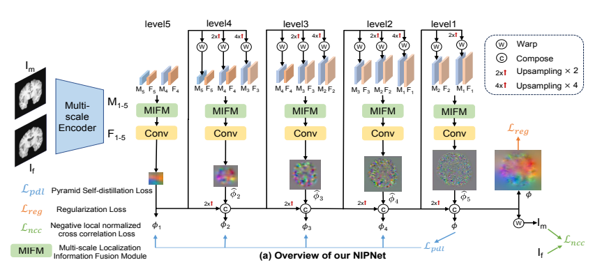

<!-- _class: cover_b fixedtitleA
<!-- _header: "" --> 
<!-- _footer: "" --> 
<!-- _paginate: "" --> 
<!-- _header:  -->

# 上海极睿医疗科技有限公司

###### 极睿影像算法--周会

徐少康
影像算法工程师
时间：2024 年   周五
<shaokang.xu@maestrosurgical.com>

##

<!-- _class: cols2_ol_ci fglass toc_a  -->
<!-- _footer: "" -->
<!-- _header: "Maestro" -->
<!-- _paginate: "" -->

- [Week 16：4月15日-4月19日（C++完善）](#week-164月15日-4月19日)
- [Week 17：4月22日-4月26日（后处理、参数）](#week-174月22日-4月26日)
- [Week 18-19：4月29日-5月10日（Spacing、参数）](#week-18-194月29日-5月10日)
- [Week 20：5月13日-5月17日（转换,合成数据）](#week-205月13日-5月17日)
- [Week 21：5月20日-5月24日（弹性代码 搭建）](#week-215月20日-5月24日)
- [Week 22：5月27日-5月31日（代码复现，3Dreg）](#week-225月27日-5月31日)
- [Week 23：6月3日-6月7日（X2CT，3Dreg）](#week-236月3日-6月7日)
- [Week 24：6月11日-6月14日（论文，数据集）](#week-246月11日-6月14日)
- [Week 25：6月17日-6月21日（模型，扩散）](#week-256月17日-6月21日)
- [Week 26：6月24日-6月28日（NipNet ）](#week-266月24日-6月28日)
- [Week 27：7月1日-7月5日（专利 ）](#week-277月1日-7月5日)
- [Week 28：7月8日-7月12日（专利 ）](#week-277月8日-7月12日)


## Week 16：4月15日-4月19日

<!-- _class: trans -->
<!-- _footer: "" -->
<!-- _paginate: "" -->

## (一) C++：mask引导划分
<!-- _class: fixedtitleA  -->
<!-- _class: cols-2 -->

<div class=Ldiv>  

- 输入图像（共四张）

```markdown 
void SigleVertebraCtLocation()//单椎体图像定位
bool RoiDivide()//区域划分
```
</div>

<div class=img >

- 单椎体投影（共两张）
 

```
void InitSingleProDRR() //单椎体投影
```

</div>

## (二)C++：推理参数后处理
<!-- _class: fixedtitleA -->
<!-- _class: cols-2 -->

<div class=Ldiv>  

- 1、旋转点计算

</div>


<div class=Ldiv>  

(1)首先取投影平面中心点**center**；
(2)连接center与投影点**source**的两点向量；
(3)取离center的**1/10**处的点为旋转点；
```markdown 
void CalculateCenterPoint() //计算平面中心点
void CalculateRotPoint()  //计算所需旋转点
```
</div>

## Week 17：4月22日-4月26日

<!-- _class: trans -->
<!-- _footer: "" -->
<!-- _paginate: "" -->

## (一) 数据后处理
<!-- _class: fixedtitleA  -->
<!-- _class: cols-2 -->
<div class=Ldiv>  


</div>
<div class=rdiv>

1、输出参数处理
Model Output **---->** Final Output
```markdown
void ParamReprocess(float* OutParamAp, float* OutParamLat)
```

2、配准时间
```markdown
aiRegis.Execute(output_data, VerteNum)
```
平均时间小于0.5s
<rdiv>

## (二)、变换参数测试
<!-- _class: fixedtitleA  -->
<!-- _class: cols-2 -->
<div class=Ldiv>

- **测试**

变换参数1：[**0.1**, **0.05** ,**-0.06**, 5.1, 4.1, -2.1]
旋转点1：[ 10. 180. 151]

RT矩阵：
[[  **0.99695305**    **0.06464505**   **0.04365358** -13.09733043]
 [ **-0.05988907**   **0.9929145**   **-0.10263575**  21.47227898]
 [ **-0.04997917**   **0.09970865**  **0.99376067** -18.60562651]
 [  0.           0.           0.           1.        ]]

旋转点2：[100. 100. 100]
变换参数2：[**0.1**, **0.05** ,**-0.06**, -2.5, 4.5, -14.25]

- **结论：** 固定的RT变换中，旋转的三个参数R𝑥, R𝑦, R𝑧在数值上不因旋转点的变化而变化。

 </div>

 <div class=rdiv>

 
RP + T 
R(P-C1)+T+C = RP-**RC1+T+C1**
R(P-C2)+T+C = RP-**RC2+T+C2**
- 平移的部分参数数值受旋转点影响
 </div>

 ## (三)、New ideal
 <!-- _class: fixedtitleA  -->


 ## (四)、现阶段测试
 <!-- _class: fixedtitleA  -->


## Week 18-19：4月29日-5月10日

<!-- _class: trans -->
<!-- _footer: "" -->
<!-- _paginate: "" -->

## (一) Spacing 统一（缩减Shrink）
<!-- _class: fixedtitleA  -->
<!-- _class: cols-3 -->

 <div class=div>

- **Train Process**

- Spacing :0.2
- SIze :1024*1024
- **物理Size**：204.8*204.8
</div>


 <div class=div>

- **Test Process(X-ray)**
 
- Spacing :0.3
- Size :1000*1000
- **物理Size**：300*300
 </div>

 <div class=div>

- **Spacing Trans**

- 物理缩减：95.2
- Size缩减 ：95.2 / 0.3 = 317.3
- Size：683*683（1000-317）
- **物理Size**：204.8*204.8
- **局限性**：X-ray缩减以外的椎体无法配准。
</div>

## (二) Spacing 统一(扩充Expand)
<!-- _class: fixedtitleA  -->
<!-- _class: cols-3 -->

 <div class=div>

- **Train Process**

- Spacing :0.2
- SIze :1024*1024
- **物理Size**：204.8*204.8
</div>

 <div class=div>

- **Test Process(X-ray)**
 
- Spacing :0.15
- Size :1000*1000
- **物理Size**：150*150
 </div>

 <div class=div>

- **Spacing Trans**

- 物理扩充：54.8
- Size扩充 ：54.8 / 0.15 = 365.3
- Size :1365*1365(1000+365.3)
- **物理Size**：204.8*204.8
- **局限性**：扩充出来的区域可能会影响推理（用ROI区域框取可以解决）
</div>

 ## (三)输入图像调整 
<!-- _class: fixedtitleA  -->
<!-- _class: cols-2 -->
 <div class=div>

- **问题**：
1、Spacing统一（扩充）后出现多余空白区域
2、X-ray图像上相应机械仪器的遮挡影响
- **处理**
1、将X-ray图像ROI区域改为椎体框
2、直接用单椎体CT投影作为初始投影DRR图像(避免初始整体投影)


 </div>

 <div class=div>

   


 </div>

 ## (四) 
<!-- _class: fixedtitleA  -->

问题：Result（**6参数**or**RT矩阵**）


1、思考如何讲旋转点信息纳入网络中（**先验知识**）
2、如何讲**物理空间特征**转化为**图像空间特征**


 ## (五) 骨折配准初始方案（刚性 + 弹性）Coarse2Fine
<!-- _class: fixedtitleA  -->
 <div class=div>

- **刚性配准**
- 一、方法
    （1）、采用迭代的方式 (可以加入**ROI选择**/**质心对齐**)
    （2）、采用学习的方式（现有论文常用）
 </div>

 <div class=div>

- **弹性配准**
通过同样两个视图的2D图像与对应的X-ray图像通过网络获取3D变形场
 
 </div>


 ## (六) ROI选择/质心对齐
<!-- _class: fixedtitleA  -->
<!-- _class: cols-2 -->

 <div class=div>

- **质心对齐**
- 使用场景：在术前与术中量数据差异性过大
 

</div>


 <div class=div>

- **ROI选择**
- 使用场景：骨头存在部分区域无形变
 
- 选择无变形的区域作为迭代配准的ROI
</div>

## Week 20：5月13日-5月17日

<!-- _class: trans -->
<!-- _footer: "" -->
<!-- _paginate: "" -->


 ## (一) 转换问题
<!-- _class: fixedtitleA  -->
<!-- _class: cols-2 -->
<div class=div>

**问题**：给定绕Y轴旋转90°，结果与主观想象差距较大 
 
 

</div>
<dic class=div>

- 问题分析
```
Param2RT(ParamDelta, RotCenterInit, MatDelta);
TransformMatrix = MatDelta * MatInit ;
```  
  
->>>>>>>>>>>>>>初定位完成后>>>>>>>>>>>>
- 初定位完成后，NDI坐标系配准到CT坐标系中，但旋转点无变化
</div>

 ##


 ## (三) 合成数据集优化
<!-- _class: fixedtitleA  -->
<!-- _class: cols-2 -->


<div class=div>


**目的**：提高每个CT合成数据的多样性
</div>

<div class=div>

**合成步骤**
- 1、通过Mask图像获取椎体列表；
- 2、从正数第三个椎体至倒数第三个椎体区间内，随机选择一个椎体的质心作为建立投影坐标系的参照点；
- 3、根据上述椎体，在其上下[-1,2]随机选取另一个椎体作为配准椎体；
- 4、在该椎体上进行多角度采样，并合成X-ray。

</div>


 ## (四) 弹性配准
<!-- _class: fixedtitleA  -->
<!-- _class: pin-3 -->

<div class=tdiv>

**Title**《Conditional Deformable Image Registration with Convolutional Neural Network》

</div>

## Week 21：5月20日-5月24日

<!-- _class: trans -->
<!-- _footer: "" -->
<!-- _paginate: "" -->

## (一)《2D/3D Non-Rigid Image Registration via Two Orthogonal X-ray Projection Images for Lung Tumor Tracking》
<!-- _class: fixedtitleA  -->
<div align=center>


- 将2D/3D弹性配准转化为3D/3D的弹性配准
</div>


## (二)数据初步制作方法
<!-- _class: fixedtitleA  -->

- 1、挑选两个不同病人的L3的CT分别作为同一个病人变形前后的MoveImage以及FixImage；

- 2、对两个CT进行处理，保证其Size（128×128×128）、spacing、origin相同；
<div align=center>


</div>

- 3、对FixImage做正侧位投影


## (三)Demo框架
<!-- _class: fixedtitleA  -->

<div align=center>


</div>

- 论文中缺少投影细节（投影图像大小，投影距离...）
- 特征共同输入UNet的输入方式


## (四)AI配准训练过程
<!-- _class: fixedtitleA  -->

<!-- _class: cols-2 -->

<div class=div>

- 单个CT的训练过程
<div align=center>


</div>

- 趋势：训练过程较为震荡（可能因为样本组合的多样性）
</div>

<div class=div>

- 数据集整理

<div align=center>


| CT      | Mask       | Vertebra     | VerteData    
|---------|----------|--------|---------|
|源CT数据 | CTMask | 单椎体CT | 单椎体数据 |
</div>


- **困难**：相应数据文件命名元素不统一，整理较慢；
</div>

## Week 22：5月27日-5月31日

<!-- _class: trans -->
<!-- _footer: "" -->
<!-- _paginate: "" -->

## (一)X-ray 2 CT
<!-- _class: fixedtitleA  -->
<!-- _footer: "Code https://github.com/kylekma/X2CT" -->

**论文**：<strong><font color=#000000 size=5>《X2CT-GAN: Reconstructing CT from Biplanar X-Rays with Generative Adversarial Networks》(CVPR2019)</font></strong>
**作者**： <font color=#000000 size=5>Xingde Ying , Heng Guo , Kai Ma, Jian Wu, Zhengxin Weng, and Yefeng Zheng</font>
**背景**：*通过正侧位X光生成对应CT图像*

<div align=center>

---- ------ 
</div>

## 测试结果展示
<!-- _class: fixedtitleA  -->
<!-- _class: cols-3 -->

<div class=div>

- **输入图像**
<div align=center>


X-ray_AP

X-ray_LAT
</div></div>

<div class=div>
<div align=center>


<font face="楷体" >生成CT</font>
</div>

- HDF5数据包含内容
  - Name: ct
  - Name: ori_size
  - Name: spacing
  - Name: xray1
  - Name: xray2

</div>

<div class=div>
<div align=center>


<font face="楷体" >真实CT</font>
</div>

- 主观评价
  - 生成效果与CT较为相似；
  - 软组织部位有细微偏差；
</div>


## 单个Demo 整CT训练效果
<!-- _class: fixedtitleA  -->

-  **整CT生成结果**：真实CT（左） 生成CT（右）
<div align=center>


</div>

- **问题**：单椎体生成较差，多个epoch测试结果都为空白图像；
- **分析**：（1）训练数据集较少；（2）单椎体2D以及3D影像信息较少；

## (二)3D Registration
<!-- _class: fixedtitleA  -->
<!-- _class: cols-3 -->
<div class=tdiv>

- **Before Registration**
<div align=center>


<font size=5 >Fix Image</font>

<font size=5>Move Image</font>
</div>
</div>


<div class=tdiv>

**>>单组数据的训练配准结果>>**
- **Registration(Before STN)**
<div align=center > 


<font size=5>Deformation Field</font>
**Dice：** 0.24 --> 0.95
 </div>
</div>


<div class=tdiv>

- **After Registration**
<div align=center>


**<font size=5>Fix Image</font>**

**<font size=5>M2F Image</font>**
</div></div>

## (三)Framework Map

<!-- _class: fixedtitleA  -->
<!-- _class: pin-3 -->
<div class=tdiv>
<div align=center >


</div></div>


<div class=ldiv>

- **数据集处理困难**
  - **方法1**：需要保证固定CT和浮动CT有相同的物理维度（需要人工手动计算、剪裁、resize）(<font color=#FF0000>时间成本较高</font>)
  - **方法2**：通过生成另外两个随机同样size的CT的变形场对原CT变形合成浮动图像。(<font color=#FF0000 >合成的CT图像相对不自然</font>)
</div>

<div class=rdiv>

- **Example**
<div align=center>

 
</div></div>


## Week 23：6月3日-6月7日
<!-- _class: trans -->
<!-- _footer: "" -->
<!-- _paginate: "" -->

## (一)数据集整理
<!-- _class: fixedtitleA  -->
<!-- _class: cols-2 -->

<div class =ldiv>

**1、X-ray2CT Datasets**
- 整理CT数据240例
  - 主要为之前整CT配准所用数据
  - 主要部位为**腰椎**
  - 训练集227例
  - 测试集40例
- 胸椎域脊椎部位数据，大都比较长
  - 太长的CT投影后的图像没办法展示其全貌；
  - 尽量控制CT的椎体数量在六个以内（**考虑剪裁以增加数据**）

</div>

<div class = rdiv>


**2、简单训练结果**
- **问题**：（1）测试主观效果较差（**原因**：推测因为数据物理尺度未能统一）
（2）训练时间较长损失下降较慢（**原因**：推测因为数据数量较少）
</div>

## (二)合成数据集过程
<!-- _class: fixedtitleA  -->
<!-- _class: cols-2-46 -->

<div class =ldiv>

**问题**：上述数据集未对训练集进行统一，虽然进入模型前会被resize到128×128×128，但其不同CT的spacing值不一样，因此训练集差异性较大。

**方法**：（1）、首先将每个CT的三个维度的spacing全部调整成1，并计算调整后的各维度size；
（2）、以CT中心为中点,沿着Z轴中点在[-40,-20,0,20,40]上下采样,剪裁出150×150×150；
（3）、共计约采样800例；
</div>

<div class =rdiv>
<div align =center>


</div></div>

## (三)X2CT训练结果
<!-- _class: fixedtitleA  -->
<div align =center>

**生成CT（左）  真实CT（右）--训练集约450例**

目前训练集又增加至810例，**正在训练中**
</div>

## (四)3D Registration 数据集整理
<!-- _class: fixedtitleA  -->
<!-- _class: cols-2-46 -->

<div class =ldiv>

- **步骤**：
  - （1）以之前配准的单椎体数据，只保留L1-L5的部分。
  - （2）将每个CT的三个维度的spacing全部调整成1，并计算调整后的各维度size；
  - （3）以椎体区域边界计算出中心点，以中心点向外剪裁128×128×128；
  - （4）共计约采样509例；
- **训练**
  - （1）所有数据互为固定以及参考图像；
  - （2）避免不同椎体之间配准训练（即L1配L1，...L5配L5）
</div>

<div class =rdiv>
<div align =center>


椎体采样

</div></div>

## 初步训练结果展示
<!-- _class: fixedtitleA  -->

<div align =center>


</div>

**问题**：现阶段结果暂时存在一些原始图像碎片以及少量体素空白；

## 论文修回
<!-- _class: fixedtitleA  -->

| 论文      | 期刊       | 状态     
|---------|----------|--------|
|《基于双视图...配准方法研究与应用》| 中华骨科杂志 |已修回（待修改） |


## Week 24：6月11日-6月14日
<!-- _class: trans -->
<!-- _footer: "" -->
<!-- _paginate: "" -->


## (一)数据集整理
<!-- _class: fixedtitleA  -->
<!-- _class: cols-2 -->

<div class =ldiv>

- 现有训练数据**123**组(去除了个别仅有三四个椎体的CT以及相关数据不完整的CT)
<div align=center>

| 数据      | 备注       
|----------|--------|
| CT      | 源CT数据       |
| Mask      | CTMask       |
| Vertebra      | 单椎体CT       |
| VerteData    | 单椎体数据       |
</div>


- 本地目前还剩**106**例未检验（待整理）
</div>

<div class =rdiv>


</div>


## (二)3D Registration优化尝试
<!-- _class: fixedtitleA  -->
<!-- _class: cols-2 -->
<div class =ldiv>

- **Voxelmorph**采用的损失函数
  - 无监督
    - L2范数（MSE）
    - 交叉互相关（CC 替代）
    - 平滑损失（Smooth）

  - 监督
    - 分割损失（Seg可选）

- **其他损失**
  - Dice
- 上述损失基本均已尝试过，效果没有多优于MSE


</div>

<div class =rdiv>


</div>

## (三)论文修改
<!-- _class: fixedtitleA  -->

| 论文      | 期刊       | 状态     
|---------|----------|--------|
|《基于双视图...配准方法研究与应用》| 《中华骨科杂志》 |已修改(待讨论) |


## Week 25：6月17日-6月21日
<!-- _class: trans -->
<!-- _footer: "" -->
<!-- _paginate: "" -->

## (一)
<!-- _class: fixedtitleA  -->

- Paper：**《SGReg: segmentation guided 3D/2D rigid registration for orthogonal X-ray and CT images in spine surgery navigation》**
- Publish： 《Physics in Medicine & Biology》
<div align=center>


</div>

## (二)模型改动
<!-- _class: fixedtitleA  -->

<div align=center>

  
</div>

- **变化**：将DenseBlock前移 
- **问题**：参数量增加、内存占用增高，BatchSzie=2时，显存超6G；
- **训练**：BatchSize：2-8，LR：0.004

## (三)扩散模型应用（Deformable Image Registration）
<!-- _class: fixedtitleA  -->

- **DiffuseMorph: Unsupervised Deformable Image Registration Using Diffusion Model（ECCV2022）**

 

<div align=center>


</div>


## (四)扩散模型应用（Style Transfer）
<!-- _class: fixedtitleA  -->

- **DDPM (Denoising Diffusion Probabilistic Models)**
  - 优点：稳定性好、可解释性高
  - 劣势：速度慢、计算资源要求高

- **Latent Diffusion Models (LDM)**
  - 优点：效率高
  - 劣势：图像质量依赖潜在空间的表示能力

- **Text-to-Image Diffusion Models**
  - 优点：文本输入友好、多样性高
  - 劣势：文本依赖性强、训练数据要求高


## (4.1) Inversion-Based Style Transfer with Diffusion Models（CVPR2023）
<!-- _class: fixedtitleA  -->
- **特点**：无需大量的文本描述（原文：艺术作品的独特之处正是因为它无法用普通语言充分解释）；


## (4.2) FreeStyle: Free Lunch for Text-guided Style Transfer using Diffusion Models （2024）
<!-- _class: fixedtitleA  -->

- **特点**：
  - 1、它建立在一个预先训练好的大型扩散模型上，无需进一步优化；
  - 2、只需通过对所需风格的文字描述即可实现风格转移；
- **"劣势"**：需要大量训练数据，对风格图像的多样性有极高的要求


## Week 26：6月24日-6月28日
<!-- _class: trans -->
<!-- _footer: "" -->
<!-- _paginate: "" -->


## (一) 代码复现

<!-- _class: fixedtitleA  -->
<!-- _class: cols-2-46 -->

<div class =ldiv>

- **Title**：Non-iterative Pyramid Network for Unsupervised Deformable Medical Image Registration（ICASSP2024）
- **创新：** 设计了一种新型的非迭代金字塔网络（NIPNet），考虑了**全局和局部变形**，引入金字塔**自蒸馏损失**；
- **代码质疑：** 两张输入在Batchsize上拼接(**目的**应该是为了通过Encoder的特征能清楚分开)

  - 问题：这样训练的BatchSize只能为1

</div>

<div class =rdiv>


</div>

## 结果检验
<!-- _class: fixedtitleA  -->
<!-- _class: cols-2-46-->

<div class =ldiv>

- 原文Loss（**Ncc,平滑，蒸馏**）：结果Dice:约**0.837**
  - 从主观位置上看，没有明显误差；
  - 单个CT基本只需要500张(次)的迭代训练；

- MSE+平滑+蒸馏: 结果Dice:约0.71

- 仅用**MSE**：结果Dice:约**0.90**
  - 训练时间较长；
  - 配准图像与固定图像的值较为接近
</div>

<div class =rdiv>
<div align = center>


原文Loss

MSE
</div></div>

## 结果检验
<!-- _class: fixedtitleA  -->
<!-- _class: cols-2-64-->

<div class =ldiv>

**问题**：多数据训练出现梯度爆炸

**猜测**：目前可能是学习率过大，或者损失需要调整（待调试）
</div>


## Week 27：7月1日-7月5日
<!-- _class: trans -->
<!-- _footer: "" -->
<!-- _paginate: "" -->

## (一)DiffDRR
<!-- _class: fixedtitleA  -->
<!-- _class: cols-2-->

<div class =ldiv>

**速度**：
  - 同一个CT连续投影100次

| 大小     | 平均单次时间        
|---------|--------|
| 512*512  |0.11秒|
| 1024*1024  |0.46秒|
  
  - 第一次投影

| 大小     |  时间        
|---------|--------|
| 512*512  |1.5-2.5秒|
| 1024*1024  |2-3秒|


</div>

<div class =rdiv>

  
- **优势**
  - DRR渲染整合为PyTorch模块的一部分，嵌入到深度学习。
  - 支持GPU加速，大幅度减少图像生成时间
  - 支持使用梯度下降进行迭代配准
</div>

## (二)DALI
<!-- _class: fixedtitleA  -->
<!-- _class: cols-2-->

<div class =ldiv>

**NVIDIA 数据加载库 (DALI: Data Loading Library)**：用于数据加载和预处理以加速深度学习应用程序的库。
- **优势**
  - 利用 GPU 的并行计算能力加速数据加载和预处理。
  - 自定义数据管道，自由组合各种预处理操作。
  - 与 PyTorch、TensorFlow 和 MXNet 等主流深度学习框架无缝集成。

</div>


<div class =rdiv>

- **现阶段局限性**
  - 目前应用中仍然需要按部就班的循环生成位置区间的X-ray样本
  - 数据预处理方面，DALI目前仅在一些数据增强（如裁剪、缩放、归一化）方面有加速优势，一些自定义的数据处理暂不支持。

</div>


## (三)专利撰写
<!-- _class: fixedtitleA  -->
<!-- _class: cols-2-37-->

<!-- _class: cols-2-37-->


</div>

<div class =rdiv>
<div align = center>

| 类型     | 名称      | 状态     
|---------|--------|--------|
| 专利  |《一种面向骨折情况下的2D/3D单椎体配准方法》| 初稿 |
| 论文  |《基于双位置图...研究与应用》| 已返修 |
| 论文材料  |伦理初审准备材料| 整理中 |


</div></div>


## Week 28：7月8日-7月12日
<!-- _class: trans -->
<!-- _footer: "" -->
<!-- _paginate: "" -->

## (一)
<!-- _class: fixedtitleA  -->


## (一)
<!-- _class: fixedtitleA  -->


## (一)
<!-- _class: fixedtitleA  -->


